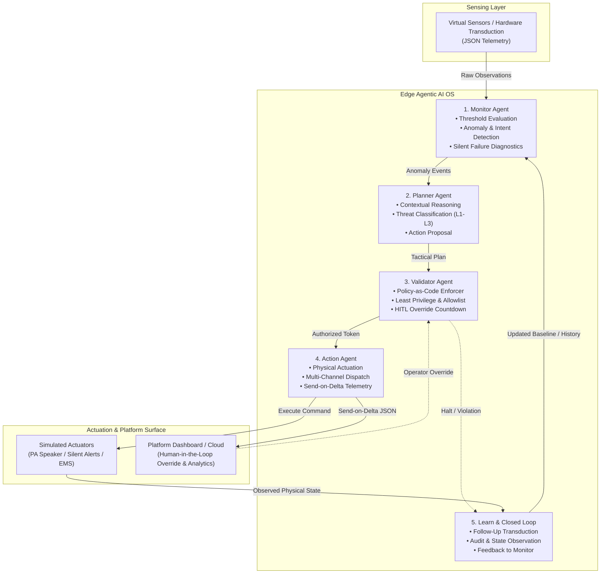

# Agentic AI OS Architecture Blueprint

## 1. Executive Summary

The **Agentic AI OS** is the autonomous, closed-loop decision engine of the **Agentic Edge-AI Smart Surveillance System (AE-SSS)**. Operating directly on the local Edge tier, the OS governs the continuous feedback cycle:

$$\text{Monitor} \longrightarrow \text{Reason} \longrightarrow \text{Validate} \longrightarrow \text{Act} \longrightarrow \text{Learn}$$

By shifting compute, validation, and closed-loop control to the edge, the system maintains sub-second responsiveness ($<1\text{s}$ edge-to-act), enforces strict policy and safety guardrails, preserves privacy, and ensures uninterrupted operation even during WAN partitions.

---

## 2. The 5-Stage Agentic Control Loop

---

## 3. Agent Responsibilities & Contracts

### 1. Monitor Agent (`edge/agents/monitor_agent.py`)
- **Responsibility:** Continuously ingests streaming JSON observations from virtual/physical sensors.
- **Functions:**
  - Performs local boundary and threshold evaluations.
  - Multi-modal signal analysis (visual movement + acoustic patterns).
  - Detects sensor degradation, packet drift, and silent hardware failures.
- **Contract:** Outputs structured anomaly events to the Planner Agent. Drops redundant steady-state samples to conserve compute.

### 2. Planner Agent (`edge/agents/planner_agent.py`)
- **Responsibility:** Ingests anomaly alerts, environmental constraints, and domain goals (e.g., UN SDGs).
- **Functions:**
  - Classifies threat levels:
    - **Level 1 (Civic/Minor):** Littering, minor public obstruction.
    - **Level 2 (Moderate):** Crowd surges, verbal altercations.
    - **Level 3 (Critical/Emergency):** Physical violence, medical collapse, weapon detection.
  - Formulates tactical response plans (e.g., local active deterrence vs. silent police dispatch).
- **Contract:** Emits proposed tactical action plans with confidence scores and justification metadata.

### 3. Validator Agent (`edge/agents/validator_agent.py`)
- **Responsibility:** Serves as the system's policy-as-code immune system.
- **Functions:**
  - Enforces least-privilege command allowlists.
  - Checks authorization, safety certificates, and expiry timestamps.
  - Manages the mandatory Human-in-the-Loop (HITL) countdown window before consequential actuation.
  - Triggers fail-safe state transitions if parameters exceed safety envelopes.
- **Contract:** Issues cryptographically verified execution tokens for approved plans; immediately revokes/halts unauthorized actions.

### 4. Action Agent (`edge/agents/action_agent.py`)
- **Responsibility:** Dispatches approved tactical commands to simulated physical actuators and platform sinks.
- **Functions:**
  - Executes active deterrence (e.g., public address announcements for civic violations).
  - Routes silent tactical dispatches (e.g., GPS coordinates and target profiles to patrol units).
  - Triggers emergency escalation (e.g., automated 1990 Suwa Seriya EMS notification for falls/collapses).
  - Publishes send-on-delta summaries to the platform dashboard.
- **Contract:** Emits actuator execution telemetry and records dispatch timestamps.

### 5. Learning & Feedback Stage
- **Responsibility:** Closes the control loop by verifying whether the physical environment reflected the intended change.
- **Functions:**
  - Initiates follow-up measurements via sensor transduction.
  - Records execution metrics and outcome validity.
  - Detects command evasion or ineffective deterrence to adjust future planning thresholds.
- **Contract:** Updates local history buffers and passes closed-loop verification results to the Monitor Agent.

---

## 4. Key Architectural Guarantees

1. **Deterministic Edge Safety:** No actuator command can bypass the Validator Agent under any circumstance.
2. **Sub-Second Execution:** Local Edge-to-Act latency targets $<1\text{s}$ for 95% of events.
3. **Data Minimization & Privacy:** Raw visual/audio streams never leave the local edge gateway; only pruned, encrypted delta metadata crosses the WAN boundary.
4. **Resilience to Partitioning:** Edge agents function autonomously during upstream network outages, maintaining local safety operations.
