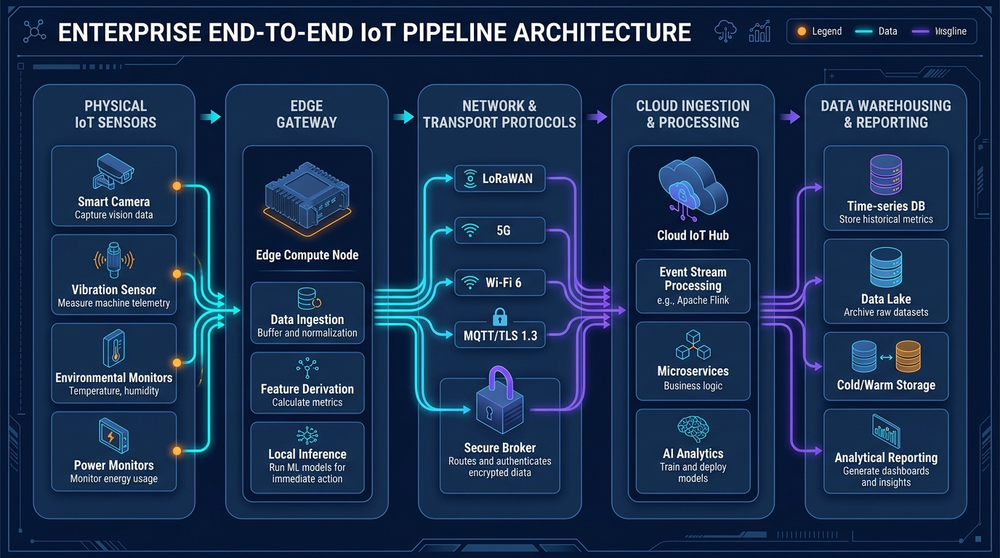
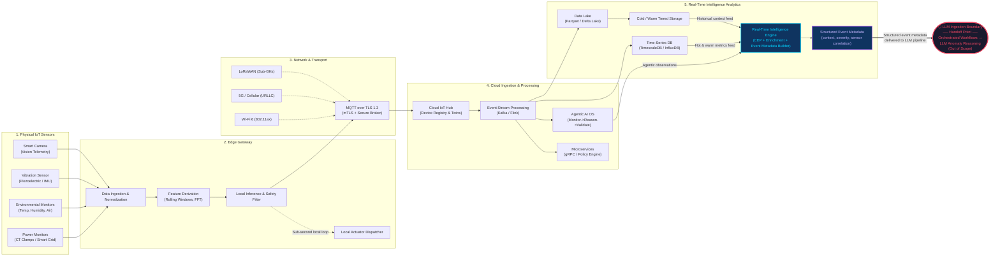

# End-to-End IoT Pipeline Architecture

## 1. Executive Summary

This document details the end-to-end telemetry and command architecture for the **Agentic Edge-AI Smart Surveillance System (AE-SSS)** and smart ecosystem. The pipeline bridges physical phenomenon sensing with edge intelligence, high-reliability networking, cloud-scale ingestion, and analytical warehousing.

The architecture is divided into five core stages:
1. **Physical IoT Sensors** (Observation transduction & physical-to-digital translation)
2. **Edge Gateway** (Edge compute, local normalization, anomaly detection & local action loop)
3. **Network & Transport Protocols** (LoRaWAN, 5G, Wi-Fi 6, MQTT/TLS 1.3, and Secure Brokerage)
4. **Cloud Ingestion & Processing** (Cloud IoT Hub, Event Stream Processing, Microservices & AI Analytics)
5. **Real-Time Intelligence Analytics & LLM Feed Boundary** (Time-series DB, Data Lake, Tiered storage, Real-Time Intelligence Engine → structured event metadata handoff to LLM)

> **Scope Note:** This document covers Stages 1–5 up to the point where structured event metadata is delivered to the LLM ingestion boundary. Downstream LLM orchestration, anomaly reasoning, and officer/soldier alerting decisions are owned and implemented by a separate team and are **out of scope** for this document.

---

## 2. High-Level Architecture Diagram



---

## 3. Detailed Architectural Stages



---

### Stage 1: Physical IoT Sensors (Perception Layer)

The physical layer converts environmental phenomena into digital observations. Devices adhere to strict sampling contracts and data formats to ensure downstream consistency.

#### Key Sensor Modalities
1. **Smart Cameras (Vision Stream)**:
   - **Transduction**: Optical sensors with lightweight onboard silicon (ISP) delivering bounding-box coordinates, motion vectors, and cropped region-of-interest (ROI) keyframes rather than raw continuous 4K video feeds to save bandwidth.
   - **Sampling Rate**: Event-triggered or 15–30 FPS with keyframe compression (H.265 / WebP).
2. **Vibration Sensors (Kinetic & Structural Telemetry)**:
   - **Transduction**: Tri-axial MEMS accelerometers and piezoelectric transducers measuring machine structural harmonics and mechanical resonance.
   - **Sampling Rate**: High-frequency burst sampling (1 kHz to 10 kHz) downsampled to frequency domain descriptors (RMS, peak-to-peak, crest factor).
3. **Environmental Monitors (Atmospheric & Ambient)**:
   - **Transduction**: NDIR (CO2), electrochemical (toxic gases), capacitive hygrometers, and thermistors.
   - **Sampling Rate**: Periodic (e.g., 0.1 Hz to 1 Hz) continuous monitoring.
4. **Power & Grid Monitors (Electrical Telemetry)**:
   - **Transduction**: Current Transformers (CT clamps), Hall-effect transducers, and voltage dividers measuring RMS voltage, real power, reactive power, and harmonic distortion across village micro-grids.
   - **Sampling Rate**: 1 Hz continuous telemetry with sub-cycle fault logging.

#### Telemetry Contract & Payload Standard
Sensors transmit ISO 8601 UTC timestamped JSON or Protocol Buffer frames.

```json
{
  "device_id": "urn:ae-sss:edge-sensor:env-042",
  "timestamp_ns": 1788520200000000000,
  "metric_type": "environmental",
  "observations": {
    "temperature_celsius": 24.85,
    "relative_humidity_percent": 58.2,
    "air_quality_index": 42
  },
  "sensor_health": {
    "battery_pct": 94,
    "drift_variance": 0.003,
    "tamper_flag": false
  },
  "signature": "3045022100e4b8...fe82"
}
```

---

### Stage 2: Edge Gateway (Edge Intelligence & Normalization)

The Edge Gateway serves as the physical bridge and first intelligence checkpoint, decoupling raw device volume from wide-area communication networks.

#### Architectural Components
- **Data Ingestion & Normalization Buffer**:
  - Implements non-blocking ring buffers to ingest asynchronous sensor bursts.
  - Converts heterogeneous device inputs (Modbus RTU, I2C, SPI, RS-485) into normalized JSON/Protobuf events.
- **Feature Derivation Engine**:
  - Computes sliding-window aggregates (e.g., 5-minute rolling averages, exponential moving averages).
  - Performs Fast Fourier Transform (FFT) analysis on vibration bursts to compute frequency spectrum bands locally.
- **Local Inference & Anomaly Detection**:
  - Executes quantized machine learning models (ONNX Runtime, TensorFlow Lite, EdgeTPU/NPU) to classify state anomalies in `< 50ms`.
  - Silent-failure detection: Monitors sensor variance and heartbeat intervals to flag "stuck at last value" failure modes before propagating corrupted data.
- **Local Closed-Loop Controller**:
  - Provides sub-second autonomous safety intervention (e.g., tripping an overloaded breaker or sounding a local hazard alarm) without awaiting cloud roundtrips.
- **Store-and-Forward Cache**:
  - SQLite/RocksDB-backed circular disk spooling that buffers telemetry during WAN outages and backfills on reconnection.

---

### Stage 3: Network & Transport Protocols (Secure Telemetry Mesh)

Data traversal from edge devices across regional gateways to central cloud endpoints utilizes dedicated networking layers chosen based on bandwidth, distance, and power constraints.

#### Network Topologies & Protocols

| Technology | Range / Coverage | Bandwidth / Throughput | Latency | Target Use Case |
|---|---|---|---|---|
| **LoRaWAN** | 2 km – 15 km (Sub-GHz) | 0.3 kbps – 50 kbps | 1 – 5 sec | Low-power battery-operated soil, ambient, and remote pipeline sensors. |
| **Wi-Fi 6 (802.11ax)** | 50 m – 100 m | Up to 9.6 Gbps | 2 – 10 ms | High-density camera streams and edge-to-gateway local cluster telemetry. |
| **5G (URLLC / eMBB)** | Wide Area / Cellular | Up to 10 Gbps | < 5 ms | High-throughput remote edge gateways, mobile assets, critical grid control. |
| **MQTT over TLS 1.3** | Global WAN / IP | Layer 7 Messaging | Variable | Lightweight, asynchronous publish/subscribe for telemetry & actuation commands. |

#### Security & Protocol Details
- **Mutual TLS (mTLS) Authentication**: Both the edge client and cloud broker verify identities using X.509 certificates anchored to hardware secure elements (TPM 2.0 or ATECC608B).
- **MQTT Topics Structure**:
  - Telemetry: `ae-sss/v1/tenant/{tenant_id}/edge/{gateway_id}/telemetry/{metric_type}`
  - Commands: `ae-sss/v1/tenant/{tenant_id}/edge/{gateway_id}/commands/{subsystem}`
  - State Sync: `ae-sss/v1/tenant/{tenant_id}/edge/{gateway_id}/state`
- **Quality of Service (QoS)**:
  - `QoS 0` (At most once): Ephemeral, high-rate environmental updates.
  - `QoS 1` (At least once): Routine telemetry and health pings.
  - `QoS 2` (Exactly once): Safety-critical state transitions, trip notices, and actuation receipts.

---

### Stage 4: Cloud Ingestion & Processing (Scalable Event Core)

The cloud layer scales elastically to handle millions of ingested events, execute agentic reasoning, and orchestrate global ecosystem state.

#### 1. Cloud IoT Hub
- Provides distributed endpoint termination with TLS 1.3 offloading.
- Maintains **Device Digital Twins** (Device Shadows) reflecting the latest reported state versus the desired system configuration.
- Manages authentication validation, certificate revocation lists (CRL), and device lifecycle events.

#### 2. Event Stream Processing
- **Distributed Streaming Backbone**: Apache Kafka / Apache Pulsar handles high-throughput message persistence partitioned by `gateway_id`.
- **Stream Processors (Apache Flink / Spark Streaming)**:
  - Real-time tumbling and sliding window calculations.
  - Complex Event Processing (CEP) for cross-sensor correlation (e.g., sudden voltage spike correlated with ambient temperature rise and camera smoke detection).

#### 3. Microservices & Agentic AI OS
- **Microservices Engine**: Stateless containerized services (Go/Python/gRPC) handling identity, access control, audit trails, and device management.
- **Agentic AI OS Engine**:
  - Implements the canonical loop: `Monitor -> Reason -> Validate -> Act -> Learn`.
  - Analyzes streaming anomalies, consults governance policies, produces explainable action plans, and checks closed-loop verification metrics before issuing downstream commands.

---

### Stage 5: Real-Time Intelligence Analytics & LLM Feed Boundary

Telemetry data transitions through tiered storage architectures based on latency and access patterns, then converges at the **Real-Time Intelligence Engine** which assembles structured event metadata and delivers it to the **LLM Ingestion Boundary** — the terminal handoff of this pipeline.

```mermaid
graph TD
    STREAM["Stream Ingestion\n(Kafka / Flink Broker)"]

    subgraph HOT["Hot Path — < 50 ms"]
        REDIS["In-Memory Cache\n(Redis / DragonFly)"]
        LIVE["Live Operational State\n(Device Twins, Active Alerts)"]
    end

    subgraph WARM["Warm Path — 50 ms to 2 s"]
        TSDB["Time-Series Database\n(TimescaleDB / InfluxDB)"]
        WINDOW["Sliding Window Aggregates\n(1-min, 5-min, 1-hr rollups)"]
    end

    subgraph COLD["Cold Path — Batch / Archival"]
        LAKE["Cloud Data Lake\n(S3 / Azure ADLS / MinIO)"]
        FORMAT["Columnar Storage\n(Apache Parquet / Delta Lake)"]
        HIST["Historical Context Store\n(Long-term patterns, training snapshots)"]
    end

    subgraph RTAI["Real-Time Intelligence Engine"]
        CEP["Complex Event Processing\n(Cross-sensor correlation, anomaly signals)"]
        ENRICH["Context Enrichment\n(geo-context, device history, severity scoring)"]
        PACK["Event Metadata Packager\n(structured payload builder)"]
    end

    LLM_FEED(["⬡ LLM Ingestion Boundary\n── Handoff Point ──\nStructured event metadata\ndelivered to LLM orchestration\n\nDownstream: anomaly reasoning,\nofficer / soldier alerting\n(Out of Scope — separate team)"])

    STREAM --> REDIS
    STREAM --> TSDB
    STREAM --> LAKE

    REDIS --> LIVE --> CEP
    TSDB --> WINDOW --> CEP
    LAKE --> FORMAT --> HIST --> CEP

    CEP --> ENRICH --> PACK
    PACK ==>|"Structured Event Metadata Feed"| LLM_FEED

    style LLM_FEED fill:#1a1a2e,stroke:#e94560,stroke-width:3px,color:#e94560
    style PACK fill:#0f3460,stroke:#a855f7,stroke-width:2px,color:#c4b5fd
    style CEP fill:#0f3460,stroke:#00d4ff,stroke-width:2px,color:#a5f3fc
    style ENRICH fill:#0f3460,stroke:#00d4ff,stroke-width:2px,color:#a5f3fc
    style RTAI fill:#0a192f,stroke:#00d4ff,stroke-dasharray: 6 3
```



#### Tiered Storage Specifications

1. **Hot Path (Real-time State & Live Operation)**:
   - **Technology**: Redis / DragonFly in-memory key-value store.
   - **Retention**: 24 to 48 hours.
   - **Output to RTAI**: Live device-twin state, active alert flags, and real-time sensor pulse feeds streamed continuously into the Complex Event Processor.
2. **Warm Path (Time-Series Querying & Rolling Analytics)**:
   - **Technology**: TimescaleDB (PostgreSQL hypertables) or InfluxDB.
   - **Retention**: 90 days with continuous aggregate rollups (1-minute, 5-minute, 1-hour, 1-day averages).
   - **Output to RTAI**: Sliding-window aggregates and short-term trend signals used for cross-sensor correlation and anomaly scoring in the CEP layer.
3. **Cold Path (Data Lake & Long-Term Archival)**:
   - **Technology**: Object Storage (S3 / Azure Data Lake / MinIO) storing compacted **Apache Parquet** or **Delta Lake** files partitioned by `year=YYYY/month=MM/day=DD/tenant_id=XYZ`.
   - **Retention**: 3 to 7+ years (regulatory compliance, seasonal pattern detection).
   - **Output to RTAI**: Historical context — baseline behavior profiles, long-term seasonal norms, and training data snapshots — provided to the Context Enrichment layer.

#### Real-Time Intelligence Engine

All three storage paths converge into the **Real-Time Intelligence Engine (RTAI)**, which is the architectural core of Stage 5:

- **Complex Event Processing (CEP)**: Correlates signals across sensor types, time windows, and geographic zones in real-time to identify multi-dimensional patterns (e.g., sudden voltage spike + camera motion + vibration burst = potential equipment intrusion).
- **Context Enrichment**: Augments raw anomaly signals with device history, geographic context, severity scoring, cluster risk levels, and relevant historical baselines.
- **Event Metadata Packager**: Serializes the enriched event context into a structured payload schema — including `event_id`, `timestamp_ns`, `severity_score`, `sensor_cluster`, `correlated_signals[]`, `historical_baseline_delta`, and `geo_zone` — ready for LLM consumption.

#### LLM Ingestion Boundary (Handoff Point)

> **This is the terminal boundary of this pipeline.**

The Event Metadata Packager delivers structured, enriched event payloads to the **LLM Ingestion Boundary** — a well-defined interface point where this IoT pipeline ends and the LLM Orchestration layer begins.

The expected payload delivered at the boundary:

```json
{
  "event_id": "evt-20260904-a7c2f91",
  "timestamp_ns": 1788523059000000000,
  "severity_score": 0.87,
  "sensor_cluster": "zone-north-grid-04",
  "geo_zone": "village-perimeter-north",
  "correlated_signals": [
    { "sensor": "cam-042",  "type": "motion_burst",     "value": "high",    "delta_from_baseline": 4.2 },
    { "sensor": "pwr-017",  "type": "voltage_spike",    "value": 438.2,    "delta_from_baseline": 85.1 },
    { "sensor": "vib-009",  "type": "vibration_rms",    "value": 12.4,     "delta_from_baseline": 9.8 }
  ],
  "historical_baseline_delta": "3-sigma above 90-day rolling average",
  "context_summary": "Multi-sensor correlated anomaly detected in north perimeter zone. Pattern consistent with physical intrusion during low-light conditions.",
  "pipeline_trace_id": "trace-ae-sss-0xf4a92b"
}
```

**Downstream (out of scope):** The LLM orchestration layer, managed by a separate team, receives this payload and runs reasoning workflows to classify the event, consult historical training data, determine threat level, and decide whether to alert the nearest officer or army personnel.

---

## 4. Operational Resilience & Safety Controls

1. **Network Partition Autonomy**:
   - In the event of backhaul failure (cellular/satellite down), the Edge Gateway continues operating in decoupled autonomous mode, executing deterministic safety rules locally.
2. **Backpressure & Graceful Degradation**:
   - When downstream cloud buffers saturate, Edge Gateways automatically drop low-priority ambient samples while preserving high-priority alarm and security event queues.
3. **End-to-End Traceability**:
   - Every telemetry packet is assigned a distributed tracing ID (`trace_id`) propagated through Kafka headers, allowing complete auditing from the millisecond of physical sensor transduction to cold storage indexing.
