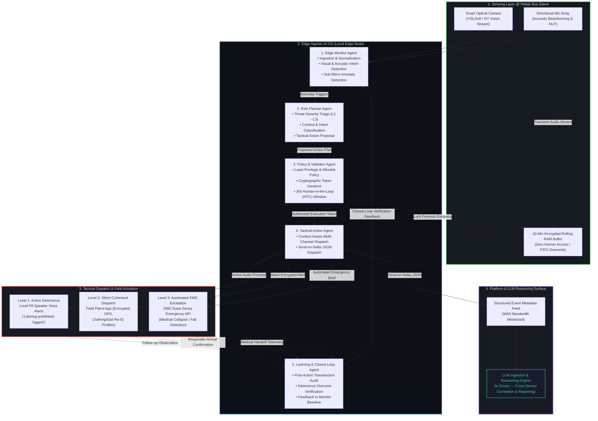

[← Back to Architecture Guide](../README.md) | [IoT Pipeline Architecture](iot-pipeline-architecture.md) | [Agentic AI OS Blueprint](agentic-ai-os-blue-print.md) | [Security Architecture](security-architecture.md)

---

# Problem Statement & Solution Overview: AE-SSS Deployment at Pettah Bus Stand

**Project Title:** Agentic Edge-AI Smart Surveillance & Response System (AE-SSS)  
**Target Location:** Pettah Central Bus Stand, Colombo, Sri Lanka  
**Event:** IEEE CS R10 Summer School Mini Ideathon  
**Repository File:** `problem_statement.README.md`  

---

## 1. Problem in Brief

Pettah Central Bus Stand is one of the most densely populated, high-footfall public transit hubs in Sri Lanka, facilitating daily commutes for hundreds of thousands of citizens, vendors, and visitors. Due to its sheer density and continuous activity, Pettah faces severe operational and public safety challenges:

* **High Crime Rates & Non-Actionable Threats:** Frequent occurrences of physical assaults, pickpocketing, sexual harassment (*street harassment/eveteasing*), and verbal altercations that escalate unnoticed.
* **Public Health Emergencies:** Sudden medical collapses, heat-stroke incidents, and elder falls occur regularly without immediate first-responder intervention.
* **Civic Violations & Environmental Degradation:** Widespread littering, illegal dumping, and public spitting (*bulath wita*) degrade public hygiene and infrastructure.
* **Victim Retaliation & Evidence Loss:** Lack of real-time pre-incident context means arguments leading up to a crime are rarely captured, leaving victims unprotected and law enforcement without forensic evidence.

### Pettah Deployment Operational Profile & Constraints

| Parameter | Operational Specification & Field Realities |
|---|---|
| **Daily Footfall** | ~250,000+ commuters, vendors, and tourists peak daily throughput |
| **Transit Density** | ~1,500+ private and SLTB commuter buses operating continuously across long-distance and suburban bays |
| **Acoustic Noise Floor** | 85–95 dBA ambient noise (engine rumble, horns, shouting) requiring directional mic arrays with beamforming noise cancellation |
| **Linguistic Diversity** | Multi-lingual distress keyword NLP across **Sinhala** (*"උදව් කරන්න"*, *"සල්ලි දීපන්"*), **Tamil** (*"காப்பாற்றுங்கள்"*), and **Sri Lankan English** (*"Help"*) |
| **Latency SLA** | $<50\text{ ms}$ local edge anomaly detection; $<1\text{ s}$ edge-to-act response |
| **WAN Bandwidth Budget** | Send-on-Delta JSON metadata (<2 KB/event) vs. continuous 4K RTSP streams (15–25 Mbps/camera saved) |
| **Privacy Mandate** | Zero permanent audio retention under nominal conditions; 10-minute encrypted FIFO RAM buffer with zero human access |

---

## 2. Disadvantages & Problems of Current Systems

The current security setup at Pettah relies on traditional CCTV networks and manual security patrols (police/military/bus stand security). This legacy setup suffers from four critical vulnerabilities:

### A. Manual Patrols & Passive Monitoring
* **Human Fatigue & Blind Spots:** Stationing static guards or requiring officers to manually monitor dozens of CCTV screens leads to cognitive overload. Critical incidents are routinely missed in real time.
* **Post-Incident Forensic Delay:** Existing CCTV acts strictly as a passive recorder. Video is analyzed hours or days *after* an offense occurred, failing to prevent active crimes or save lives during medical emergencies.

### B. Severe Network & Storage Bottlenecks
* Continuous 24/7 high-definition RTSP streaming from dozens of cameras saturates local network bandwidth and incurs massive centralized storage costs, making continuous retention economically unsustainable.

### C. Lack of Contextual Severity Logic (Alert Fatigue)
* Traditional automated motion-detection tools lack intent recognition. They trigger frequent false alarms for harmless crowd density while failing to differentiate between a minor verbal argument and a life-threatening knife attack.
* Emitting loud local sirens during critical crimes alerts perpetrators prematurely, allowing them to flee into Pettah's crowded lanes before law enforcement arrives.

### D. Privacy Violations & Legal Barriers
* Constant audio recording creates severe legal eavesdropping concerns under local privacy laws. Conversely, recording *no audio* strips away critical spoken threat context (e.g., *"give me the money"*, *"help"*).

---

## 3. Proposed Solution: AE-SSS (Agentic Edge-AI Smart Surveillance System)

AE-SSS replaces passive recording with an **Agentic Edge-AI framework** that senses, reasons, validates, acts, and learns directly at the camera node in real time.

### Core Solution Features for Pettah

1. **Multi-Modal Threat Detection (Visual + Acoustic NLP):**
   * Processes video frames (YOLOv8/ViT) and acoustic signals simultaneously.
   * Recognizes spoken Sinhala/Tamil/English distress keywords (*"උදව් කරන්න"*, *"සල්ලි දීපන්"*, *"මරනවා"*) and acoustic signatures (screams, glass breaks).

2. **Context-Aware Tactical Response (Silent vs. Active Dispatch):**
   * **Level 1 (Minor Violations - Littering/Spitting):** Triggers **Active Deterrence Mode** via local speakers (*"Littering is prohibited; footage logged"*).
   * **Level 2 (Critical Crimes - Assaults/Robbery):** Triggers **Silent Command Mode**. Local alarms remain off to prevent suspect flight. Sends silent visual alerts, live target tracking coordinates, and gait/clothing Re-ID parameters to nearby patrol officers' mobile apps.
   * **Level 3 (Medical Emergencies - Fall Detection/Unconsciousness):** Executes **Automated Emergency Medical Escalation (EMS)** to automatically dispatch GPS location and situation briefs directly to 1990 Suwa Seriya / nearest medical units.

3. **10-Minute Zero-Access Rolling Edge RAM Buffer (Privacy Guardrail):**
   * Raw audio is **never stored permanently** or transmitted to central servers during normal conditions.
   * Holds a rolling 10-minute encrypted FIFO RAM buffer at the edge node that continuously overwrites itself.
   * **Zero Human Access:** Strictly monitored by the local AI engine. Only upon a verified threat trigger is the pre-incident audio context locked and encrypted as forensic evidence.

4. **Self-Diagnostics & Predictive Maintenance:**
   * Aligned with IEEE Day 2 principles, an internal **Health Monitor Agent** detects camera tampering, lens obstruction/blur, mic dead-lines, and system drift, automatically generating maintenance tickets before hardware failure occurs.

5. **Closed-Loop Verification & Learning (Self-Healing Control):**
   * Performs follow-up sensor transduction to verify whether an action produced the intended physical outcome (e.g., verifying noise level drop after a warning, or confirming responder arrival).
   * Feeds empirical results back into the Monitor and Planner agents to continuously refine detection and threshold logic.

---

## 4. Architectural & Comparative Advantage

| Evaluation Dimension | Legacy CCTV Networks | Centralized Cloud-Only AI | AE-SSS (Agentic Edge-AI) |
|---|---|---|---|
| **Response Latency** | Hours to days (post-incident forensic review) | 3 to 15 seconds (WAN round-trip dependency) | **< 1 second edge-to-act** (autonomous local loop) |
| **WAN Bandwidth Usage** | Continuous 15–25 Mbps per camera stream | Continuous high-bandwidth video ingestion | **< 2 KB per event** (Send-on-Delta metadata only) |
| **Offline Survivability** | Local storage only; zero response capability | Complete failure during network outage | **100% operational autonomy** during WAN partitions |
| **Public Privacy** | Unbounded recording risks or blind visual monitoring | Central cloud storage of unvetted raw feeds | **10-min Zero-Access RAM Buffer**; zero permanent raw audio |
| **Threat Contextualization** | None (blind passive recording) | Basic bounding-box motion detection | **Multi-modal Visual + Acoustic NLP triage (L1–L3)** |
| **Tactical Action** | None (manual officer dispatch) | Generic broadcast push notification | **Context-aware:** Local voice deterrence vs. Silent tactical dispatch |

---

## 5. SDG Alignment (Sustainable Development Goals)

AE-SSS directly advances four United Nations SDGs within urban transit environments:

* **SDG 11: Sustainable Cities & Communities**
  * **Target 11.2 (Safe & Accessible Transport):** Secures Pettah Central Bus Stand for vulnerable commuters, women, children, and the elderly against harassment and assault.
  * **Target 11.6 (Reduce Urban Environmental Impact):** Curbs public littering and waste dumping via automated active deterrence audio prompts.
  * **Target 11.7 (Safe Public Spaces):** Transforms high-density transit hubs into safe, inclusive public spaces.

* **SDG 3: Good Health & Well-Being**
  * **Target 3.6 & 3.d (Emergency Risk Reduction):** Provides automated early warning and immediate dispatch (1990 Suwa Seriya integration) for sudden heat-strokes, physical collapse, and severe injuries.

* **SDG 8: Decent Work & Economic Growth**
  * **Target 8.8 (Safe Working Environments):** Protects bus drivers, conductors, shop vendors, and transit staff from workplace violence and intimidation.

* **SDG 9: Industry, Innovation & Infrastructure**
  * **Target 9.1 & 9.4 (Resilient Infrastructure):** Upgrades legacy CCTV infrastructure into a resource-efficient, edge-computed, low-bandwidth smart ecosystem.

---

## 6. Conclusion

The deployment of AE-SSS at the Pettah Central Bus Stand bridges the critical gap between passive sensing and real-time intervention. By shifting intelligence to the edge, AE-SSS eliminates bandwidth saturation, protects public privacy through a 10-minute rolling zero-access buffer, and ensures that critical medical and violent emergencies receive immediate, context-aware responses. 

AE-SSS turns traditional, passive CCTV networks into an active, privacy-preserving, and life-saving guardian for Sri Lanka's public transit ecosystem.

---

[← Back to Architecture Guide](../README.md) | [IoT Pipeline Architecture](iot-pipeline-architecture.md) | [Agentic AI OS Blueprint](agentic-ai-os-blue-print.md) | [Security Architecture](security-architecture.md)1