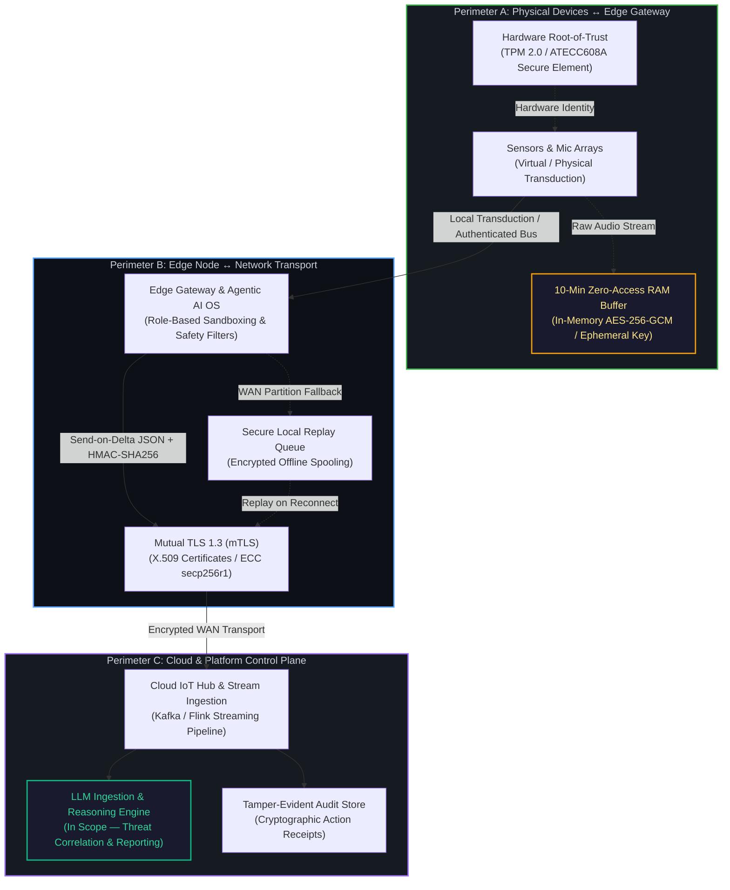

[← Back to Architecture Guide](../README.md) | [Problem Statement](problem_statement.README.md) | [IoT Pipeline Architecture](iot-pipeline-architecture.md) | [Agentic AI OS Blueprint](agentic-ai-os-blue-print.md)

---

# Security Architecture & Trust Boundaries: AE-SSS

**Project Title:** Agentic Edge-AI Smart Surveillance & Response System (AE-SSS)  
**Event:** IEEE CS R10 Summer School Mini Ideathon  
**Repository File:** `docs/security-architecture.md`  

---

## 1. Overview & Core Security Principles

The **Agentic Edge-AI Smart Surveillance System (AE-SSS)** is architected around zero-trust principles, least privilege, cryptographic identity verification, and deterministic safety guardrails. Because AE-SSS operates in high-density public environments (such as Pettah Central Bus Stand), security and privacy must be enforced at hardware, transport, and agentic decision levels.

The system enforces six foundational security tenets:
1. **Zero-Trust Device Identity:** Every physical sensor and edge gateway must prove its identity using cryptographic certificates before entering the ecosystem.
2. **Strict Least-Privilege Role Boundaries:** Each agent in the agentic OS operates within sandboxed permissions—no agent can escalate privileges or access unapproved command surfaces.
3. **Approved Command Set (Allowlists):** Consequential actuation is strictly limited to pre-approved, safe commands. Risky, unknown, or out-of-envelope commands are dropped and logged.
4. **Mandatory Human-in-the-Loop (HITL) & Stop Rule:** Automated processes trigger a mandatory 30-second override window for human operator intervention on critical actions.
5. **Privacy-by-Design (Zero-Access Buffer):** Raw audio is never permanently recorded. In-memory encrypted rolling RAM buffers overwrite themselves every 10 minutes unless an authorized forensic trigger occurs.
6. **Tamper-Evident Auditability & Offline Resilience:** Real-time immutable event logs ensure full accountability. If WAN connections fail, edge nodes continue safe local autonomous operation and securely replay buffered events once connectivity is restored.

---

## 2. Threat Model & Trust Boundaries

The AE-SSS ecosystem enforces three defensive perimeters with distinct trust assumptions and security controls:

### Perimeter A: Physical Device to Edge Gateway
* **Zero-Trust Onboarding:** Every sensor must present a verified device credential and valid schema fingerprint.
* **Physical Tampering Mitigations:** Lens obstruction, microphone dead-line, and accelerometer displacement trigger hardware integrity alarms via the Health Monitor Agent.
* **Hardware Root-of-Trust:** Device cryptographic keys are anchored in secure elements (TPM 2.0 / ATECC608A) to prevent spoofing.

### Perimeter B: Edge to Cloud Transport
* **Two-Way Authentication (mTLS 1.3):** Edge gateways and platform brokers mutual-authenticate via X.509 certificates (ECC secp256r1 or RSA-4096).
* **Protocol Downgrade Protection:** Telemetry transport strictly enforces TLS 1.3 cipher suites, rejecting cleartext or weaker SSL/TLS handshakes.
* **Offline Resilience & Spooling:** In the event of network disconnection, edge nodes continue local closed-loop operation. Data is queued in an encrypted local spool and synchronized upon reconnection.

### Perimeter C: Cloud & Control Plane
* **Access Governance:** Role-Based Access Control (RBAC) and Attribute-Based Access Control (ABAC) partition municipal operators, field officers, and administrative users.
* **Cryptographic Action Receipts:** All actuation commands and operator overrides generate HMAC-signed receipts stored in immutable audit logs.

---

## 3. Cryptographic Standards & Token Lifecycle

| Security Dimension | Standard / Specification | Operational Implementation |
|---|---|---|
| **Identity & Transport Encryption** | Mutual TLS 1.3 (mTLS) | X.509 certificates with ECC `secp256r1` or `RSA-4096` |
| **Payload Integrity & Provenance** | HMAC-SHA256 | Command payloads and safety-critical telemetry signed with secret key pairs |
| **Ephemeral Token Lifecycle** | Signed JWT / Execution Tokens | Issued by Validator Agent with strict time-to-live ($\text{TTL} < 15\text{ minutes}$) |
| **Local RAM Buffer Encryption** | AES-256-GCM / ChaCha20-Poly1305 | Ephemeral symmetric keys rotated and wiped from memory every 10 minutes |
| **Tamper Resistance** | SHA-256 Hash Chaining | Audit events logged in an append-only, tamper-evident record store |

---

## 4. Privacy Guardrail: 10-Minute Zero-Access Rolling RAM Buffer

Public transit surveillance must comply with strict civil privacy standards. AE-SSS resolves the conflict between continuous recording and situational context through an encrypted in-memory buffer:

1. **Continuous FIFO In-Memory Overwrite:** Raw acoustic audio streams are held exclusively in a 10-minute rolling FIFO memory buffer.
2. **Zero Human Access:** Under nominal conditions, operators and administrators cannot listen to or inspect live or stored audio streams.
3. **Automatic Key Destruction:** In-memory encryption keys are rotated and zeroed out continuously. Data older than 10 minutes is permanently overwritten.
4. **Forensic Locking on Level-3 Trigger:** Only when the Policy & Validator Agent validates a critical incident (e.g., violent assault keyword or physical collapse), the 10-minute pre-incident window is locked, signed with a cryptographic receipt, and preserved as forensic evidence.

---

## 5. Transport & Agent Constraints (Least Privilege Sandbox)

Each agent in the AE-SSS closed loop is strictly bound to its least-privilege operational envelope:

```mermaid
flowchart LR
    P["1. Monitor / Perception Agent\n(Read-Only Telemetry Ingress)"] -->|"Structured Anomaly Event"| R["2. Risk Planner Agent\n(Internal Contextual Reasoning)"]
    R -->|"Proposed Action Plan"| V["3. Safety & Validator Agent\n(Policy-as-Code Gatekeeper)"]
    V -->|"Signed Cryptographic Token"| A["4. Tactical Action Agent\n(Approved Command Actuation)"]
    A -->|"Closed-Loop Observation"| L["5. Learning & Audit Stage\n(Immutable Verification Log)"]

    style P fill:#0f3460,stroke:#58a6ff,stroke-width:2px,color:#c9d1d9
    style R fill:#0f3460,stroke:#a371f7,stroke-width:2px,color:#c9d1d9
    style V fill:#1a1a2e,stroke:#f59e0b,stroke-width:2px,color:#fde68a
    style A fill:#0f3460,stroke:#f85149,stroke-width:2px,color:#c9d1d9
    style L fill:#0f3460,stroke:#3fb950,stroke-width:2px,color:#c9d1d9
```

### 1. Perception / Monitor Agent
* **Permissions:** Read-only access to sensor telemetry streams.
* **Constraints:** **MUST NOT** modify device configuration, network routing, or actuator states.

### 2. Edge Intelligence / Risk Planner Agent
* **Permissions:** Ingests anomaly alerts, performs contextual severity classification (L1–L3), and drafts tactical response proposals.
* **Constraints:** **MUST NOT** dispatch external alerts directly, bypass policy validation, or issue execution commands.

### 3. Safety & Security / Validator Agent
* **Permissions:** Validates proposed plans against Policy-as-Code allowlists, checks certificate validity, manages 30s HITL override windows, and issues signed execution tokens.
* **Constraints:** **MUST NOT** initiate unprompted physical actions; acts strictly as the policy gatekeeper.

### 4. Tactical Action Agent
* **Permissions:** Dispatches approved tactical commands (PA announcements, silent patrol alerts, 1990 EMS escalation).
* **Constraints:** **MUST NOT** execute any command without a valid, unexpired cryptographic token from the Validator Agent. Rejects unapproved parameters.

### 5. Learning & Audit Stage
* **Permissions:** Captures follow-up sensor observations, audits system response effectiveness, and updates historical baselines.
* **Constraints:** All audit logs are append-only. **MUST NOT** modify or delete past execution receipts.

---

## 6. Closed-Loop Safety & Fail-Safe Mechanisms

* **Hardware Watchdog:** An independent hardware timer requires periodic keep-alive heartbeats from the Edge Agentic AI OS. If the OS freezes or crashes, the watchdog trips the node into a safe fallback state.
* **Network Partition Survivability:** If cloud connectivity drops, edge nodes maintain 100% operational autonomy for local safety and active deterrence, spooling non-critical telemetry into encrypted local storage until WAN restoration.
* **Approved Command Set Allowlists:** Consequential actions are constrained to an explicit command dictionary (e.g., `TRIGGER_LOCAL_DETERRENCE_AUDIO`, `DISPATCH_SILENT_ALERT`, `EMS_NOTIFICATION`). Arbitrary shell execution or arbitrary remote payloads are structurally prevented.

---

[← Back to Architecture Guide](../README.md) | [Problem Statement](problem_statement.README.md) | [IoT Pipeline Architecture](iot-pipeline-architecture.md) | [Agentic AI OS Blueprint](agentic-ai-os-blue-print.md)
